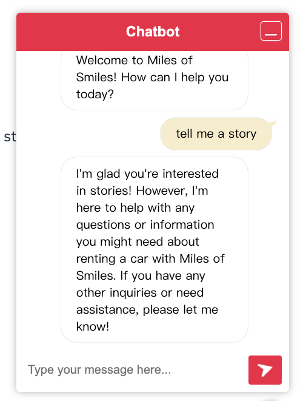

# Step 04 - System messages

In [step 1](step-01.md), we saw two types of messages:

- User messages (`User`)
- AI responses (`Assistant`)

There are other types of messages, and this step is about _System message_.
It's an important type of message.
It provides the _scope_ of the conversation and provides instructions to the LLM.

## System messages

A _system message_ in a LLM is a directive that helps guide the model’s behavior and tone during an interaction.
It typically sets the context, role, or boundaries for the model, defining how it should respond to the user.

System messages are crucial for shaping the model’s output, ensuring it aligns with specific requirements such as
formality, topic focus, or specific task execution. Unlike user input, the system message remains hidden from the
conversation but influences the overall experience.

To add a system message, we need to enhance our `CustomerSupportAgent` interface.
==Update the `CustomerSupportAgent` interface content to become:==

```java hl_lines="12-16" title="CustomerSupportAgent.java"
--8<-- "../../step-04/src/main/java/dev/langchain4j/quarkus/workshop/CustomerSupportAgent.java"
```

If you do not follow the workshop, the `step-04` directory already contains the updated `CustomerSupportAgent`
interface.

As you can see, we added the `@SystemMessage` annotation to the `chat` method.
This is how we add a system message to the LLM.
We define the context, tone, and scope of the conversation.

## System message and memory

Remember the _conversation memory_ we talked about in [step 1](step-01.md)?
We are sending all the messages exchanged between the user and the AI to the LLM, so the LLM can provide a context-aware
response.

At some point, we may have too many message and we need to evict some of them.
In general, we remove the oldest message.
However, we always keep the system message.
We only remove the user and AI messages.

So, the LLM still understands the context and does not change its behavior radically because of the memory eviction.

## Playing with the system message

Now, let's test the system message.
Make sure the application is running and open the browser at [http://localhost:8080](http://localhost:8080).

==Let's ask the LLM to tell us a _story_==

```
Tell me a story
```


The AI should respond with a message that it is out of context.
You can relatively easily work around this by asking for a _car rental story_, but there are other solution to this
problem.

What's important is to have a system message defining the scope of the conversation and the role of the AI.
This will never be lost, even if the conversation is very long.

Alright, let's now go a bit further and implement a RAG pattern!
That's the topic of the [next step](./step-05.md)!
